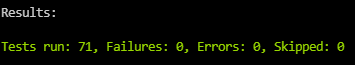

# Google Coding Challange - Summer 2021

**Completed 4/4 Parts:**:

Possible error while parcing ***the video.txt*** file:

Currently parcing the resource file as provided in the original code:

`File file = new File(this.getClass().getResource("/videos.txt").getFile());`

During implementation, I had to use full path to read the ***video.txt***  resource file properly:

`File file = new File("C:/Users/Anton/Desktop/Bright Network/google-code-sample/java/src/main/resources/videos.txt");`

**Used with:**

*apache-maven-3.8.1*

*Java 11.0.8*

*Junit 5.4*

Author: **Anton Minkov**
